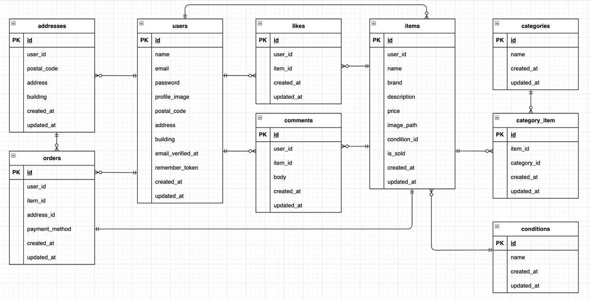

# flea-market

## 環境構築

### Dockerビルド
- git clone <https://github.com/ayana0331/flea-market.git>
- docker-compose up -d --build

### Laravel環境構築
- docker-compose exec php bash
- composer install
- cp .env.example .env # 環境変数を必要に応じて変更
- php artisan key:generate
- php artisan migrate
- php artisan db:seed

### メール送信設定（Mailtrap）
`.env` ファイルに以下の設定を追加してください。

```bash
MAIL_MAILER=smtp
MAIL_HOST=sandbox.mailtrap.io
MAIL_PORT=2525
MAIL_USERNAME=あなたのMailtrapユーザー名
MAIL_PASSWORD=あなたのMailtrapパスワード
MAIL_ENCRYPTION=null
```

### Stripeキー設定
`.env` ファイルに以下の設定を追加してください。
テスト用キーは Stripe Dashboard から取得してください。

```bash
STRIPE_KEY=your_stripe_key
STRIPE_SECRET=your_stripe_secret
```

### 使用技術
- 言語: PHP 8.4.14
- フレームワーク: Laravel 12.34.0
- データベース: MySQL 8.0.26
- 認証: Laravel Fortify
- 決済: Stripe
- メール認証: Mailtrap


## ER図



## URL (開発環境)
- トップページ http://localhost/
- ユーザー登録 http://localhost/register

### テストユーザー
動作確認用のユーザー
- email: yamada@example.com
- password: yamadatest
