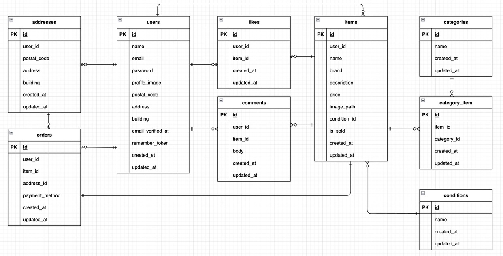

# flea-market　追加機能実装

## 環境構築

### Dockerビルド
- git clone <https://github.com/ayana0331/flea-market.git>
- docker-compose up -d --build

### Laravel環境構築
- docker-compose exec php bash
- composer install
- cp .env.example .env # 環境変数を必要に応じて変更
- php artisan key:generate
- php artisan migrate
- php artisan db:seed
- php artisan storage:link

### メール送信設定（Mailtrap）
`.env` ファイルに以下の設定を追加してください。

```bash
MAIL_MAILER=smtp
MAIL_HOST=sandbox.mailtrap.io
MAIL_PORT=252
MAIL_USERNAME=あなたのMailtrapユーザー名
MAIL_PASSWORD=あなたのMailtrapパスワード
MAIL_ENCRYPTION=null
```

### 使用技術
- 言語: PHP 8.4.14
- フレームワーク: Laravel 12.34.0
- データベース: MySQL 8.0.26
- 認証: Laravel Fortify
- メール認証: Mailtrap


## ER図



## URL (開発環境)
- ログイン画面 http://localhost/login

### テストユーザー
動作確認用のユーザー1
- email: test@example.com
- password: password

動作確認用のユーザー2
- email: test2@example.com
- password: password

動作確認用のユーザー3
- email: test3@example.com
- password: password
取引チャット動作確認のために、ユーザー3に購入済みのダミーデータを入れています。